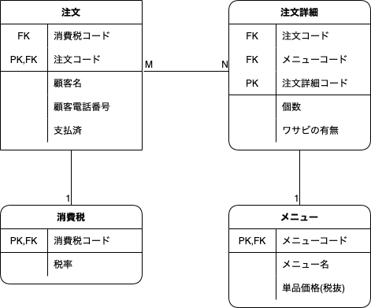
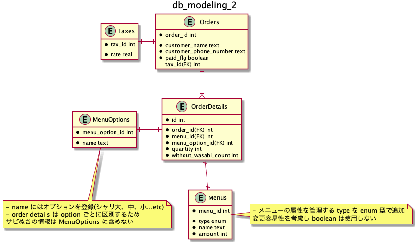
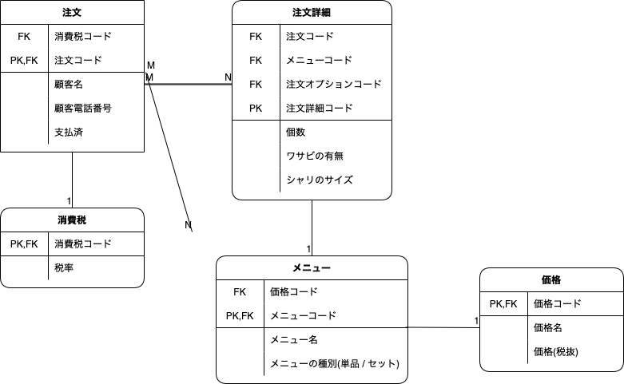

## 前提

### 顧客情報について

- 顧客情報を管理する必要性があるのかが不明であること、また注文表の情報のみでは一意な顧客情報を管理することは難しいと判断し顧客情報について正規化は行わなかった

### 金額について

- 永続化しなくても算出できるため永続化をしていない
- 要件によってパフォーマンスに影響が出るようであれば永続化したほうが良さそう

### 日付関連のカラムについて

- 注文表のデータを保存するにはこれらの情報が無くても必要十分と判断し定義していない

### サビ抜きの表現について

- boolean で表現するか悩んだが、レコード数が少なくなる利点からサビ抜きの皿数をカウントするスキーマとした

### 物理モデルと論理モデルについて(任意課題)
- 概念モデル(論理モデルを作成する上で必要なためこちらも記載する)
  - エンティティおよびそれらのリレーションの概要を表したもの
- 論理モデル(logical data model:LDM)
  - 特定の DBMS に依存しないレベルで具現化した状態
  - つまり、カラム名などは DBMS のルールに従った命名にする必要はなく、作成者および共有者に伝わりやすいように作成することが大事
    - DBMS に従った命名とは `order_id` のようなもの
  - 具体的には概念モデルに対して以下の肉付けを行ったもの
    - Attribute 
    - Identifire 
    - 外部キーの定義
    - リレーションシップ
    - カーディナリティ
    - その他
      - 厳密に定義されているわけではないようなので、論理モデルの目的を超えない範囲で都度必要なものを定義して良さそう
      - スキーマに含まれるがエンティティの本質的なアトリビュートではない要素は省略した方が良さそう(`created_at` や `updated_at` のようなもの)
  - 物理モデル(phisical data model:PDM)
  - 特定の DBMS 向けに設計するために作成するモデル
  - 具体的には論理モデルに対し以下の肉付けを行なったもの
    - データ型
    - DBMS に合わせたテーブル名やカラム名などの命名の変更
      - オフィシャルで定められているものから慣例的なルールに従っているものがありそう

### ER 図

- IDEF1X 表記を採用(直感的でわかりやすいと判断)
- 課題の回答にふさわしいものとして論理モデルの ER 図を使用している
- 上記のため、物理モデルで考慮すべきデータ型は記入していない

## issue_1

## issue_2

- 変更点は以下
  - シャリの大中小などはメニューに対するオプションとし `MenuOptions` テーブルを追加、あわせて `OrderDetails` のスキーマを更新
  - メニューの属性を管理する `type` を `Menus` に追加

## issue_3

- 皿の価格改定に合わせてそれに紐つくネタの値段を更新できるようにしたい
  - -> 皿の価格があり、それに属するネタがあるという寿司屋の寿司の価格の現実に即したスキーマに修正した
