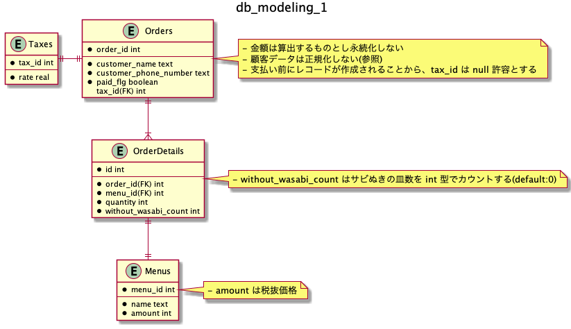
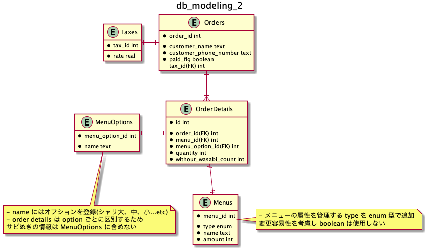

## issues_1
- 顧客情報について
  - 顧客情報を管理する必要性があるのかが不明であること、また注文表の情報のみでは一意な顧客情報を管理することは難しいと判断し顧客情報について正規化は行わなかった
- 金額について
  - 永続化しなくても算出できるため永続化をしていない
  - 要件によってパフォーマンスに影響が出るようであれば永続化したほうが良さそう
- 日付関連のカラムについて
  - 注文表のデータを保存するにはこれらの情報が無くても必要十分と判断し定義していない
- サビ抜きの表現について
  - boolean で表現するか悩んだが、レコード数が少なくなる利点からサビ抜きの皿数をカウントするスキーマとした 
- ERD の関係線

| Type |  記号  |
| ---- |  ---- |
| 1のみ | `\|\|--` |
| 1以上 | `}\|--` |

## issues_2
- 変更点は以下
  - シャリの大中小などはメニューに対するオプションとし `MenuOptions` テーブルを追加、あわせて `OrderDetails` のスキーマを更新
  - メニューの属性を管理する `type` を `Menus` に追加

## issues_3
- 発注や在庫管理の観点から、セットメニューも含む実際に売り出されたネタの個数