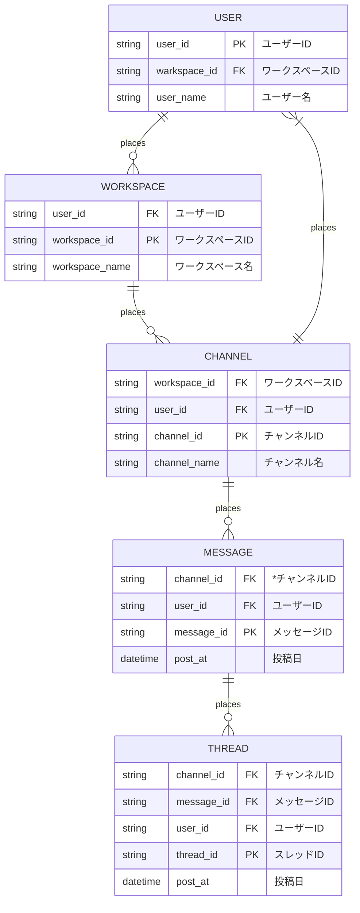

```mermaid
erDiagram
   USER ||--o{ WORKSPACE : places
    USER {
        string user_id PK "ユーザーID"
        string warkspace_id FK "ワークスペースID"
        string user_name "ユーザー名"
    }
    WORKSPACE {
        string user_id FK "ユーザーID"
        string workspace_id PK "ワークスペースID"
        string workspace_name "ワークスペース名"
    }
   WORKSPACE ||--o{ CHANNEL : places
   CHANNEL ||--|{ USER : places
   CHANNEL {
        string workspace_id FK "ワークスペースID"
        string user_id FK "ユーザーID"
        string channel_id PK "チャンネルID"
        string channel_name "チャンネル名"
    }
   CHANNEL ||--o{ MESSAGE : places
    MESSAGE {
        string channel_id FK "*チャンネルID"
        string user_id FK "ユーザーID"
        string message_id PK "メッセージID"
        datetime post_at "投稿日"
    }
   MESSAGE ||--o{ THREAD : places
     THREAD {
        string channel_id FK "チャンネルID"
        string message_id FK "メッセージID"
        string user_id FK "ユーザーID"
        string thread_id PK "スレッドID"
        datetime post_at "投稿日"
    }

```