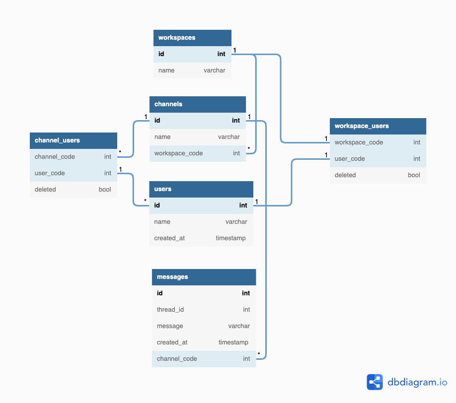

### メッセージ
### スレッドメッセージ
### チャネル
### ユーザ
### 横断機能
#### メモ
- ユニーク制約でも null は値は格納できる
- slack のレスポンス

```json
[
    {
        "client_msg_id": "",
        "type": "message",
        "text": "test",
        "user": "{user.id}",
        "ts": "{timestamp]",
        "team": "{team.id}",
        "blocks": [
            {
                "type": "rich_text",
                "block_id": "",
                "elements": [
                    {
                        "type": "",
                        "elements": [
                            {
                                "type": "text",
                                "text": "test"
                            }
                        ]
                    }
                ]
            }
        ],
        "thread_ts": "{thread_timestamp}",
        "reply_count": 1,
        "reply_users_count": 1,
        "latest_reply": "{timestamp}",
        "reply_users": [
            "{user.id}"
        ],
        "is_locked": false,
        "subscribed": true,
        "last_read": "{timestamp}"
    },
]
```